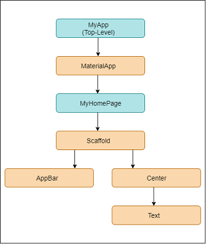

> # Flutter 
---
## What is Flutter?

Flutter is Google’s open-source UI toolkit for building cross-platform apps with a single codebase.

- **Cross-Platform**: Runs on Android, iOS, web, and desktop.
- **Dart Language**: Uses Google’s Dart programming language.
- **Fast Development**: Hot reload for quick UI changes.
- **Customizable UI**: Rich widgets for responsive, beautiful designs.
- **High Performance**: Skia engine for smooth, native-like performance.

Flutter is popular for its efficiency and versatility in app development.


## Native vs Cross-platform vs Hybrid:
| Aspect             | Native                        | Cross-Platform                   | Hybrid                           |
|--------------------|-------------------------------|----------------------------------|----------------------------------|
| **Codebase**       | Separate for each platform    | Single for all platforms         | Single for all platforms         |
| **Performance**    | High                          | Near-native                      | Lower (depends on web view)      |
| **Access to Features** | Full access             | Limited access (depends on SDK)  | Limited                          |
| **Development Time**   | Longer                   | Moderate                         | Shortest                         |

### Key Milestones
- **May 2017**: Alpha release at Google I/O.
- **December 2018**: Flutter 1.0, first stable release for mobile.
- **2019**: Web support introduced (beta).
- **March 2021**: Flutter 2, stable support for web and improved desktop support.

Flutter’s goal is to enable developers to build beautiful, natively compiled applications for multiple platforms from a single codebase, making it a powerful tool for modern app development.


## Benefits of Flutter

- **Cross-Platform Development**: Write one codebase and deploy it across Android, iOS, web, and desktop, reducing development time and costs.

- **Fast Development with Hot Reload**: Instant updates to the app's UI without restarting, allowing faster testing and debugging.

- **High Performance**: Flutter uses the Skia rendering engine for fast, smooth performance, achieving near-native speeds on devices.

- **Rich Widget Library**: Flutter provides a wide range of customizable widgets, allowing developers to create visually appealing and responsive UIs.

- **Open-Source and Community-Driven**: Backed by Google and an active community, Flutter is constantly updated and has extensive documentation and support.

- **Dart Language**: Dart’s fast execution and ease of learning make Flutter development smoother, with support for both JIT and AOT compilation.

- **Consistent UI Across Platforms**: With a single codebase, apps have a uniform look and feel on different platforms, making branding and design easier.

- **Access to Native Features**: Flutter allows integration with platform-specific APIs through plugins, enabling access to device features like camera, GPS, and sensors.

- **Growing Ecosystem**: Flutter’s ecosystem is continuously growing, with numerous plugins and packages available to add functionality.
  
  
---
 
<div style="text-align:center"></div>

---

# Basic Input-output:
---

```dart
import 'dart:io'; // Importing library for input-output operations

void main() {
  // Prompting user for input
  print('Enter your name:');
  
  // Reading input from the console
  String? name = stdin.readLineSync(); // The '?' allows 'null' value if no input is provided

  // Outputting the input received
  print('Hello, $name!'); // Using '$' to insert the variable's value into the string
}


```

# Variable:
---

```dart
void main() {
  // 1. Declaring variables with types
  int age = 25; // 'int' for whole numbers
  double price = 19.99; // 'double' for decimal numbers
  String name = 'Alice'; // 'String' for text
  bool isStudent = true; // 'bool' for true/false values

  // Printing variables
  print('Name: $name'); // Outputs: Name: Alice
  print('Age: $age'); // Outputs: Age: 25
  print('Price: $price'); // Outputs: Price: 19.99
  print('Is Student: $isStudent'); // Outputs: Is Student: true

  // 2. Using 'var' - type is inferred by Dart
  var city = 'New York'; // Dart infers 'String' type
  var score = 92.5; // Dart infers 'double' type
  print('City: $city, Score: $score');

  // 3. Using 'dynamic' - allows reassignment to any type
  dynamic variable = 'Hello';
  print(variable); // Outputs: Hello
  variable = 123; // Can now hold an integer
  print(variable); // Outputs: 123

  // 4. Using 'final' - runtime constant (cannot be reassigned)
  final String country = 'USA';
  print('Country: $country');
  // Trying to reassign 'country' will cause an error:
  // country = 'Canada'; // Uncommenting will cause a compile error

  // 5. Using 'const' - compile-time constant (fixed at compile time)
  const double pi = 3.1416;
  print('Pi: $pi');
  // Trying to reassign 'pi' will cause an error:
  // pi = 3.14; // Uncommenting will cause a compile error

  // 6. Difference between 'final' and 'const'
  final currentTime = DateTime.now(); // 'final' can hold runtime values
  print('Current Time: $currentTime');
  
  // const compileTime = DateTime.now(); // Error: const can't use non-compile-time values

  // 7. 'late' keyword - deferred initialization
  late String lateVar;
  lateVar = 'This is initialized later';
  print(lateVar); // Outputs: This is initialized later
}
```

# Functions:
---
```dart
void main() {
  // 1. Basic function without parameters
  greet(); // Calls greet function, Output: Hello!

  // 2. Function with parameters and return type
  int sum = addNumbers(5, 10);
  print('Sum: $sum'); // Output: Sum: 15

  // 3. Function with named parameters
  displayUserInfo(name: 'Alice', age: 25); // Output: Name: Alice, Age: 25

  // 4. Anonymous function (lambda) as a callback
  List<int> numbers = [1, 2, 3, 4];
  numbers.forEach((num) {
    print(num * num); // Squares each number, Output: 1, 4, 9, 16
  });

  // 5. Arrow function
  int product = multiply(3, 4);
  print('Product: $product'); // Output: Product: 12
}

// 1. Basic function declaration without parameters and return type
void greet() {
  print('Hello!');
}

// 2. Function with parameters and return type
int addNumbers(int a, int b) {
  return a + b;
}

// 3. Function with named parameters
void displayUserInfo({required String name, required int age}) {
  print('Name: $name, Age: $age');
}

// 4. Anonymous function (lambda) - passed as argument
void printSquares(List<int> numbers) {
  numbers.forEach((num) {
    print(num * num);
  });
}

// 5. Arrow function - short syntax for single-line functions
int multiply(int a, int b) => a * b;

```


